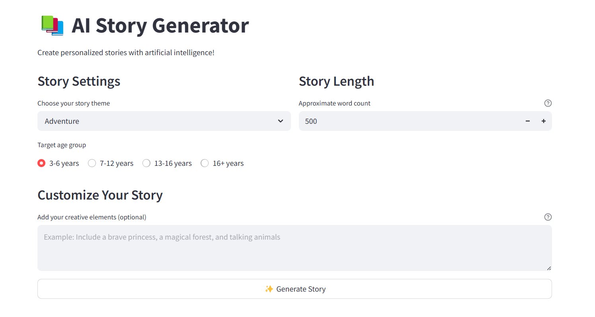

# 📚 AI Story Generator

An interactive web application that generates customized stories using Google's Gemini AI. Create engaging stories tailored to specific age groups, themes, and creative elements.



## ✨ Features

- Generate stories of varying lengths (100-2000 words)
- Choose from multiple story themes (Adventure, Fantasy, Science Fiction, etc.)
- Target specific age groups (3-6 years, 7-12 years, 13-16 years, 16+ years)
- Add custom creative elements to personalize stories
- Download generated stories as text files

## 🛠️ Installation

1. Clone the repository:
   ```bash
   git clone https://github.com/mrnithesh/story-generator.git
   cd story-generator
   ```

2. Install the required dependencies:
   ```bash
   pip install -r requirements.txt
   ```

3. Set up your environment variables (see Configuration section)

## ⚙️ Configuration

1. Create a `.env` file in the project root directory
2. Add your Google Gemini API key:
   ```
   GEMINI_API_KEY=your_api_key_here
   ```

> 🔑 **Get an API Key**: Obtain your Gemini API key from the [Google AI Studio](http://aistudio.google.com/apikey/).

## 🚀 Usage

1. Run the Streamlit application:
   ```bash
   streamlit run app.py
   ```

2. Open your web browser and navigate to the URL displayed in your terminal (typically http://localhost:8501)

3. Configure your story settings:
   - Select a theme
   - Choose an age group
   - Set the desired word count
   - Add optional custom elements

4. Click "Generate Story" and enjoy your personalized story!

## 📋 Requirements

- Python 3.7+
- Streamlit
- Google Generative AI Python SDK
- python-dotenv

## 📝 License

MIT

## 🤝 Contributing

Contributions, issues, and feature requests are welcome! Feel free to check the [issues page](https://github.com/mrnithesh/story-generator/issues).
